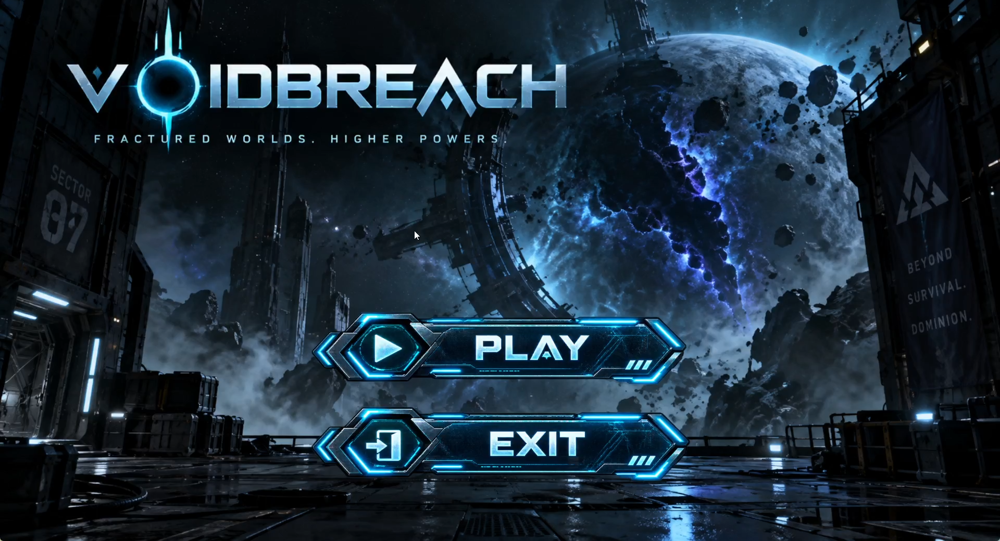
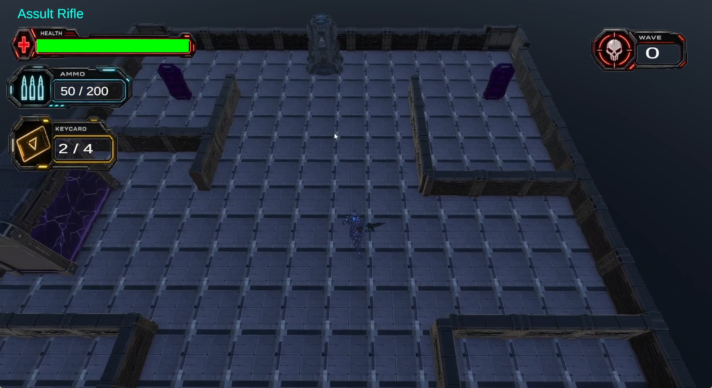
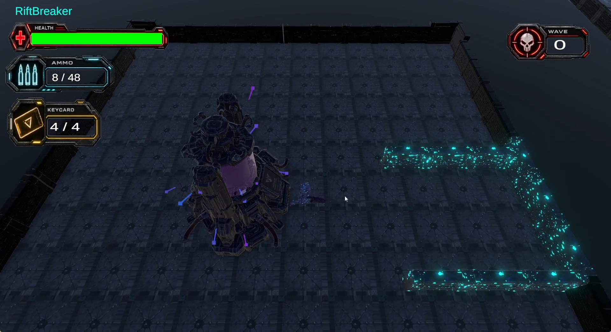
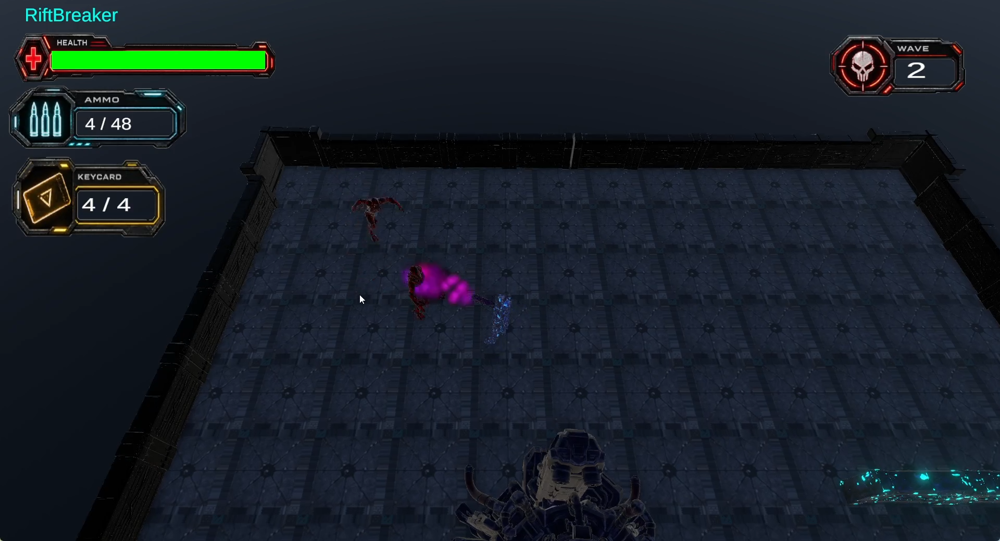
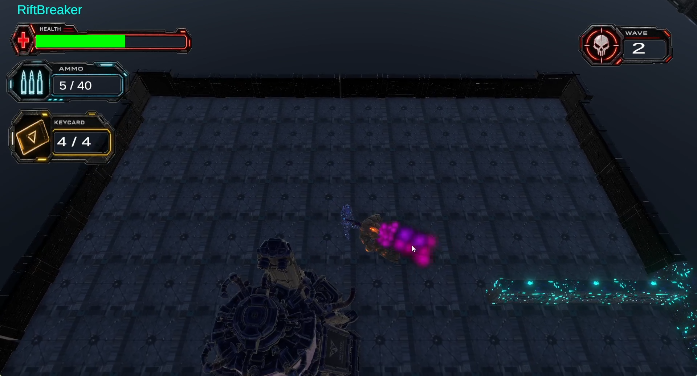
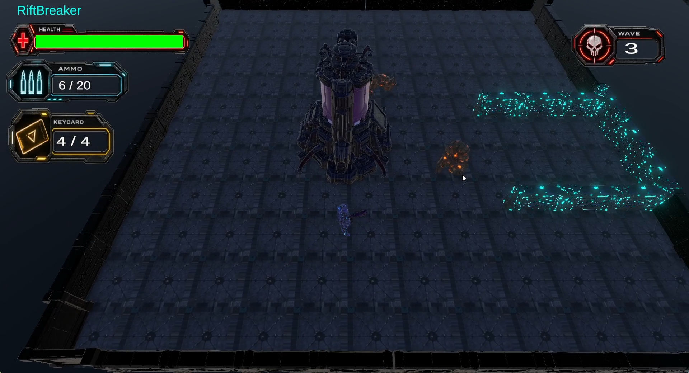
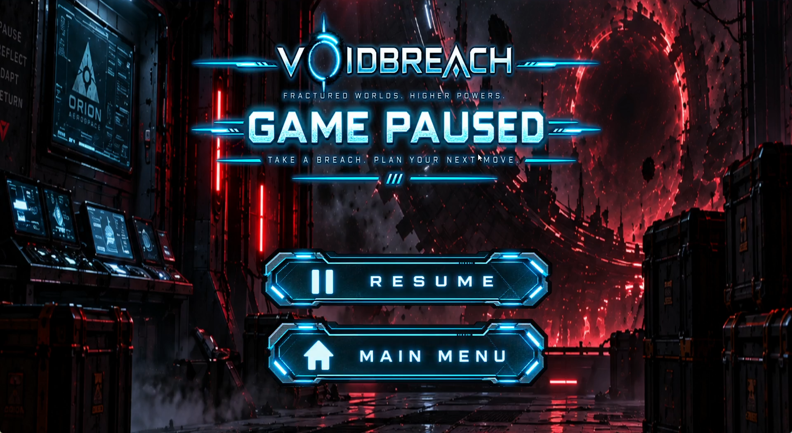
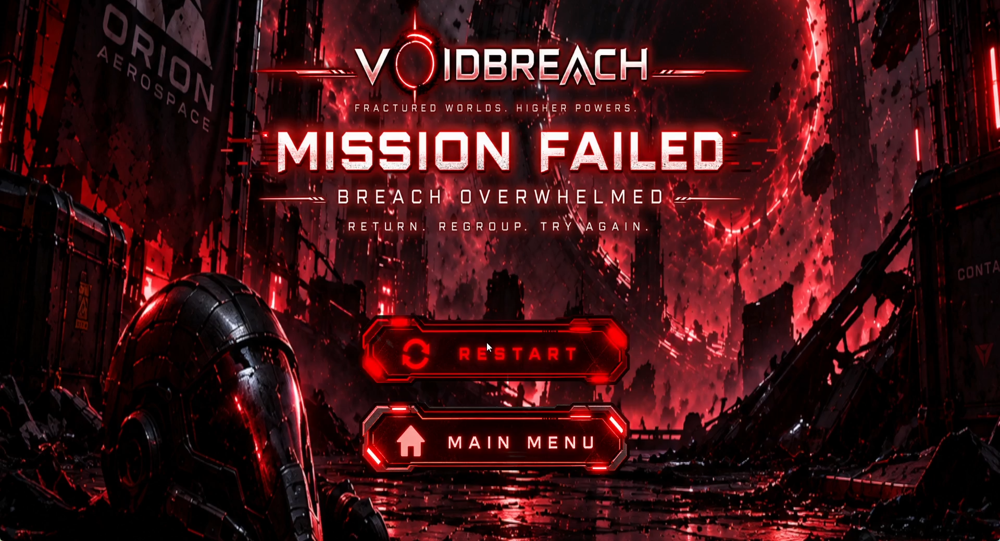
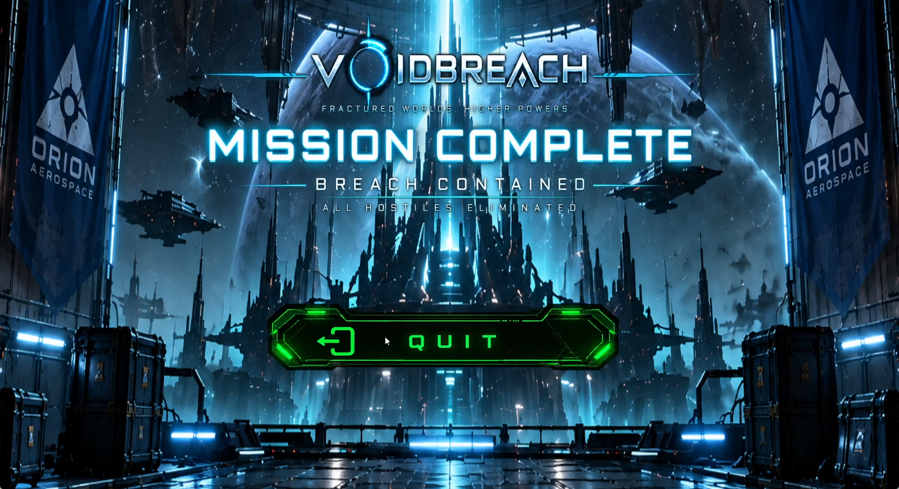

# VOIDBREACH

### 3D Top-Down Sci-Fi Shooter • Unity • C#

VOIDBREACH is a 3D top-down sci-fi shooter developed in Unity using C#. Players explore a hostile futuristic facility, collect keycards to gain access to the battle arena, activate a mysterious Power Surge and survive escalating waves of enemies using multiple weapons.

---

## 🎮 Gameplay

The player progresses through the facility by collecting four keycards before gaining access to the main battle arena.

Once inside, activating the Power Surge begins a multi-wave combat encounter featuring different enemy types and attacks.

### Core Features

- 3D top-down movement and combat
- Multiple weapons and weapon switching
- Raycast shooting
- Ammunition and reloading
- State-based enemy AI
- Enemy-specific attacks
- Multi-wave spawning system
- Keycard-based level progression
- Power Surge encounter
- Player health and damage
- HUD and gameplay UI
- Main menu, pause, victory and defeat states
- VFX, animation and audio integration

---

## 🤖 Enemy AI

Enemies use state-based behaviour to transition between:

`Idle → Patrol → Chase → Attack`

Different enemy types build on this foundation with their own attacks and behaviours.

---

## 🔫 Weapon System

VOIDBREACH features multiple weapons built around a shared weapon architecture.

The system handles:

- Weapon switching
- Raycast shooting
- Damage
- Fire rate
- Magazine ammunition
- Reserve ammunition
- Reloading
- Shooting VFX
- Weapon audio
- HUD integration

---

## 🌊 Wave System

The battle arena uses a multi-wave spawning system that:

- Spawns different enemy combinations
- Tracks living enemies
- Controls delays between spawns
- Detects wave completion
- Progresses automatically to the next wave
- Triggers victory after the final encounter

---

## ⚡ Power Surge

The Power Surge acts as the central trigger for the battle arena.

Activating it combines:

- Gameplay triggers
- Particle effects
- Audio
- Delayed wave activation
- Enemy spawning
- Arena progression

---

## 🛠️ Technologies

- Unity
- C#
- Visual Studio
- Blender
- Unity Particle System
- Unity Animator
- Meshy

---

## 📸 Gameplay Screenshots

### Main Menu

### Starting Area

### Power Surge

### Combat

### Pause Menu

### Defeat

### Victory

---

## 💻 Selected Source Code

This repository contains selected C# scripts demonstrating the core systems I developed for VOIDBREACH.

### AI
- Enemy state logic
- Enemy-specific behaviours

### Combat
- Shared weapon system
- Player shooting and weapon switching

### Systems
- Wave spawning
- Power Surge activation
- Level progression

### UI
- HUD and game-state systems

---

## 👨‍💻 Developer

**Ahsan Akbar**

Unity & C# Game Developer

Portfolio: Coming soon  
LinkedIn: Coming soon
